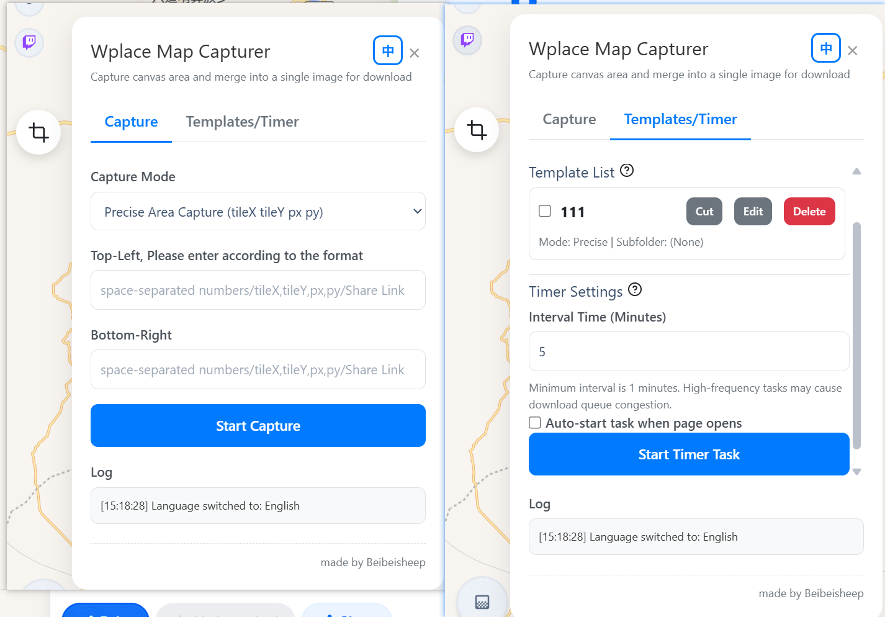

# Wplace.live Map Capturer

> 🇨🇳 [中文说明请点这里](./README-zh.md)

An advanced area capture and template management tool for [wplace.live](https://wplace.live).

## Features

- Area capture: Capture any region on the wplace.live map by entering coordinates or pasting share links.
- Multi-block merging: Merge multiple map tiles into a single large image.
- Template management: Save commonly used regions as templates for quick one-click capture or scheduled backups.
- Scheduled tasks: Automatically download all selected templates at custom intervals, with support for subfolders.
- Internationalization: Easily switch the interface between English and Chinese.
- Action log: All actions and errors are logged in a built-in log view for reference and troubleshooting.
- Error highlighting: Missing or failed tiles are highlighted in the output image, and detailed logs are recorded.

## Installation

1. Download and unzip the repository.
2. Open Chrome and go to `chrome://extensions/`, enable "Developer mode".
3. Click "Load unpacked" and select "LOAD_UNPACKED" folder.
4. Visit [wplace.live](https://wplace.live/) to use the extension.

## Support & Feedback

If you have questions, suggestions, or want to contribute, please open an [Issue](https://github.com/yourname/yourrepo/issues) or submit a Pull Request