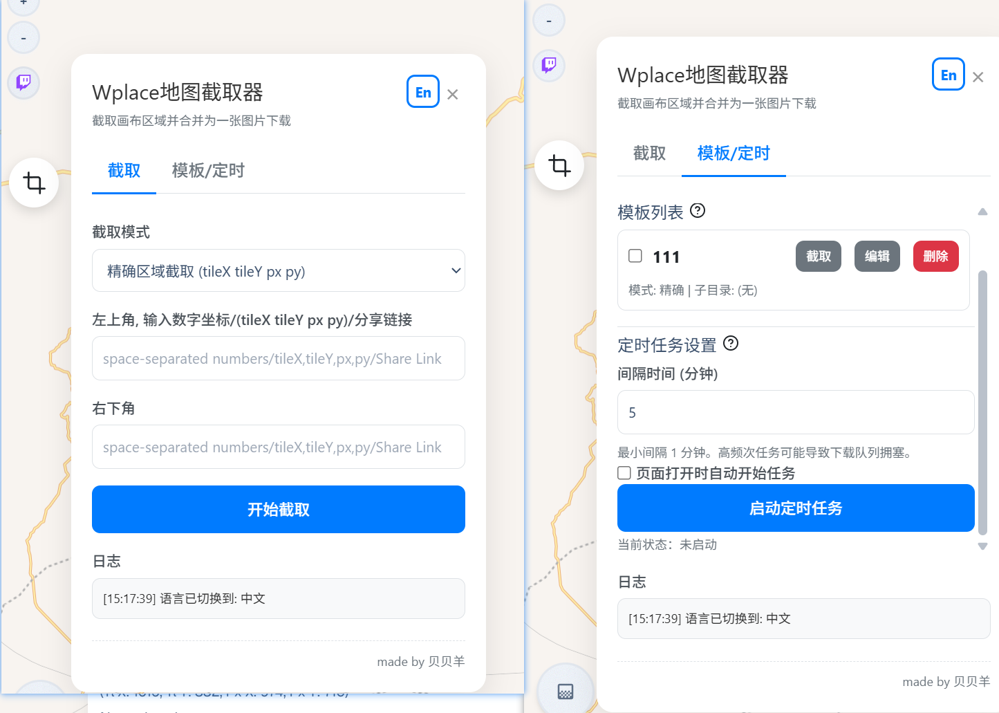

# Wplace.live 地图截取器

> English version available at [README.md](./README-en.md)

为 [wplace.live](https://wplace.live) 打造的高级区域截取与模板管理工具。

## 功能列表

- 区域截取：灵活输入坐标或粘贴分享链接，截取地图任意区域。
- 多区块合并：支持选择多个区块，合成为一张大图。
- 模板管理：常用区域可保存为模板，便于一键截取或定时批量备份。
- 定时任务：自定义间隔，自动下载所有选中模板，并可指定子文件夹保存。
- 国际化切换：界面可一键切换中英文。
- 操作日志：所有操作和错误均详细记录，便于追溯和排查。
- 错误高亮：截取过程中如有瓦片丢失，图片会高亮显示缺失区域，并记录详细日志。

## 安装方法

1. 下载并解压本仓库源码
2. 打开 Chrome，进入 `chrome://extensions/`，右上角开启“开发者模式”
3. 点击“加载已解压的扩展程序”，选择LOAD_UNPACKED文件夹
4. 访问 [wplace.live](https://wplace.live/) 即可使用

## 支持与反馈

如有问题或建议，欢迎在 [Issues](https://github.com/Beibeisheep/Wplace-Map-Capturer/issues) 区留言或提交 PR
